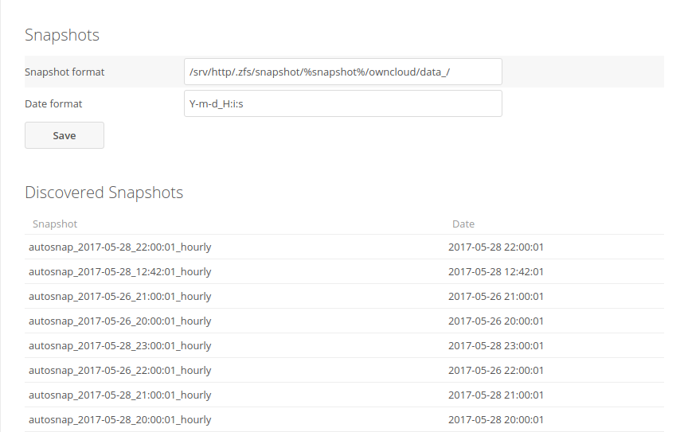

# files_snapshots

Access filesystem snapshots from Nextcloud.



Allows using filesystem snapshots (such as provided by zfs and btrfs) instead of builtin Nextcloud versions.

## Limitations

This app does not automatically create snapshots itself, because of this it might not have a snapshot
for every change made to the file.

Since no snapshots are created by the app, when reverting a file, any change made to a file since the last snapshot will be lost.

## Configuring

In order to access snapshots, two things need to be configured under the admin settings.

- snapshot format: where the snapshots of the Nextcloud data directory can be found
 
  example: `/srv/http/.zfs/snapshot/%snapshot%/nextcloud/data/`  
  where `/srv/http/nextcloud/data` is the Nextcloud data directory  
  and `/srv/http` is a folder which is being snapshoted to `/srv/http/.zfs/snapshot`.
  
  Additionally, if your snapshots are organized over multiple directories like
  
  ```
  /.snapshots/hourly/2020-02-07_00:00/...
  /.snapshots/hourly/2020-02-07_01:00/...
  /.snapshots/daily/2020-02-06_00:00/...
  /.snapshots/daily/2020-02-07_00:00/...
  ```

  you can use a glob such as `/.snapshots/*/%snapshot%/` to make the app search for snapshots in multiple directories.
   
- snapshot folder date format: How the snapshot date is formatted in the snapshot name

  Specifications about the format: http://php.net/manual/de/datetime.createfromformat.php
  
  Example: `*Y-m-d_H:i:s*` will correctly match snapshots named `autosnap_2017-05-27_00:00:01_hourly`
  
  Hint: Each * will only match until the next separator or digit
  
  Example: `*-*-*-Y-m-d-Hi`  will correctly match snapshots named `zfs-auto-snap_frequent-2017-06-23-1930`
